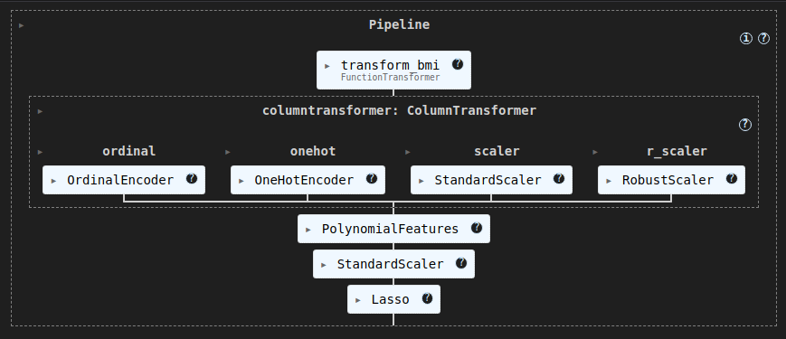

# Prédiction d'une prime d'assurance 


## Contexte Professionnel


En tant que Full Stack data dans une société de conseil, on répond à un appel d'offre pour développer un outil de machine Learning : **Assur’Aimant**, un assureur français opérant historiquement à un niveau national, décide de s’implanter aux États-Unis. L’assureur sollicite plusieurs sociétés spécialisées dans l’IA pour créer une solution permettant d’estimer la prime d’assurance de ses souscripteurs sur ce marché. Actuellement, les courtiers estiment les primes d’assurance en utilisant des ratios et leur expérience. Cependant, cette méthode est longue et coûteuse.

L’objectif est de créer une solution permettant d’estimer la prime d’assurance des souscripteurs aux Etats-Unis.

### Objectifs
- Réaliser une analyse approfondie des données
- Développer  et évaluer un modèle de prédiction
- Créer une application 

---

## Fonctionnalités Implémentées

### 1. Nettoyage des données
- **Import du csv** :

- **Vérification des valeurs nulles** :
  - .isnull()
  - test de la librairie missingno

- **Exportation des données** :

### 2. Analyse des données
- **Identification des valeurs aberrantes** :
  - IQR : Interquantile range
  - Z-score

- **Distribution des données** :
  - Analyse graphique de la distribution des variables continues
  - Analyse de la répartition de variables discrètes

- **Analyse bivariée** :
  - Test de Chi² pour chaque couple de variables discrètes
  - Test Anova entre chaque couple de variables discrètes et continues
  - Test de Pearson pour voir chaque couple de données continues
  - Visualisations de distributions, des comparaisons bivariées et multivariées

### 3. Modélisation par régression linéaire
- **Régression linéaire simple** :
  - Régression avec X = age, X = bmi
  - Régression avec l'ensemble des variables continues
  - Régression avec l'ensemble des variables

- **Test des régularisation** :
  - Test Ridge
  - Test Lasso 
  - Test ElasticNet

- **Ajout de Polynomial Features** :
  - Test des degrés

- **Catégorisation de bmi** :
  - Choix de la meilleure régularisation
  - Choix du degré pour le polynomial features

- **Creation d'une pipeline** :
  - Création d'une fonction pour la transformation de bmi
  - Encodage des variables discrètes
  - Standardisation/ Transformation des variables
  - Transformation polynomiale
  - Standardisation 
  - Régression linéaire avec régularisation Lasso



### 4. Création d'une application
- **Création d'une interface utilisateur**
L'utilisateur rentre ses données personnelles dans un formulaire


- **Lien ML et interface**
L'algorithme de machine learning permet de prédire le montant de la prime d'assurance


---

## Installation et Utilisation

### Prérequis
- Python 3.8+


### Étapes d’installation

Clonez le dépôt Git :

   ```bash
   git clone <git@github.com:ludivineRB/prime_assurance_prediction.git>
   ```

## Instructions

### Installez les dépendances :
```bash
pip install -r requirements.txt
```

### Lancer l'application :

```bash
streamlit run streamlit_app/home.py
```


